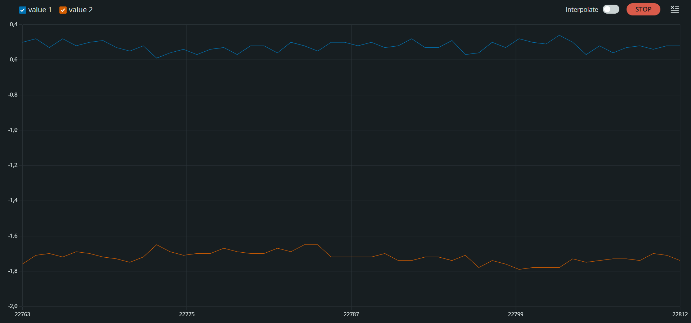
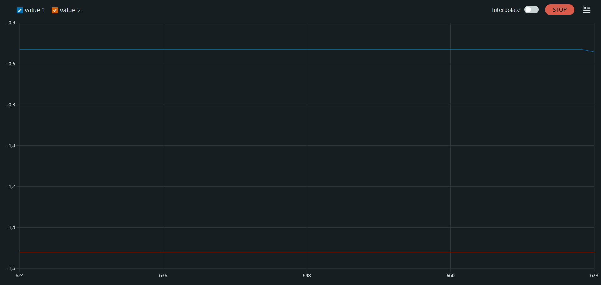

## 📊 Kalman Filter Performance (Before vs. After)

| Raw Accelerometer (Before) | 1D Kalman Filter (After) |
| :---: | :---: |
|  |  |
| *High-frequency jitter & vibration noise* | *Noise eliminated, deterministic state estimation* |

# 1D Kalman Filter & IMU Attitude Estimation on STM32

A bare-metal attitude estimation engine running on an **STM32 (ARM Cortex-M)** microcontroller interfaced with an **MPU6050 6-DOF IMU** over hardware I2C at 400 kHz.

The firmware fuses high-frequency angular velocity from the gyroscope with gravity-referenced inclination from the accelerometer using a custom **discrete 1D Linear Kalman Filter**, eliminating integration drift and vibration noise in real time.

---

## Overview

Inertial sensors present complementary error profiles:

* **Accelerometer:** Provides absolute static tilt angles, but contains high-frequency noise from mechanical vibrations.
* **Gyroscope:** Provides smooth and responsive dynamic rates, but exhibits low-frequency integration drift over time.

This project implements a lightweight **1D Kalman Filter** running inside a deterministic 250 Hz (4 ms) loop, delivering filtered Pitch and Roll estimates without relying on external filter libraries.

### Key Capabilities

* **Direct Register Manipulation:** Direct configuration of MPU6050 Digital Low-Pass Filter (DLPF @ 10 Hz), sensitivity ranges (+/-8g, +/-500 deg/s), and power management registers over 400 kHz Fast I2C.
* **Pre-Run Bias Calibration:** 2000-sample initialization loop to measure and null stationary gyroscope zero-rate bias offsets.
* **Discrete Linear Kalman Filtering:** State prediction, dynamic Kalman Gain calculation, and measurement update stages executed independently on Roll and Pitch axes.
* **Real-Time Telemetry:** CSV formatted stream over 57600 baud UART, compatible with the Arduino Serial Plotter and external logging systems.

---

## Processing Architecture

```
[ MPU6050 IMU ]
       │
       ├──► [ Raw Accel (X, Y, Z) ] ────► [ Trigonometric Tilt Projection ] ──► [ AngleRoll / Pitch ] (Measurement)
       │                                                                                     │
       └──► [ Raw Gyro (X, Y, Z) ] ─────► [ Zero-Bias Subtraction ] ─────────► [ RateRoll / Pitch ] (State Input)
                                                                                             │
                                                                                             ▼
                                                                           ┌────────────────────────────────────┐
                                                                           │    1D Discrete Kalman Filter       │
                                                                           │  • Predict state via Gyro rate     │
                                                                           │  • Extrapolate error covariance    │
                                                                           │  • Compute dynamic Kalman Gain     │
                                                                           │  • Correct state via Accel angle   │
                                                                           └────────────────────────────────────┘
                                                                                             │
                                                                                             ▼
                                                                           [ Filtered Roll & Pitch Telemetry ]
                                                                                             │
                                                                                   (UART @ 57600 Baud)

```

---

## Mathematical Formulation

The 1D Kalman Filter executes five recursive equations per axis at each iteration step (dt = 0.004s):

1. **State Extrapolation (Predict):**
$x_{k\vert{}k-1} = x_{k-1\vert{}k-1} + \Delta t \cdot u_k$
2. **Covariance Extrapolation:**
$P_{k\vert{}k-1} = P_{k-1\vert{}k-1} + \Delta t^2 \cdot Q$
3. **Kalman Gain Computation:**
$K = \frac{P_{k\vert{}k-1}}{P_{k\vert{}k-1} + R}$
4. **Measurement Update (Estimate):**
$x_{k\vert{}k} = x_{k\vert{}k-1} + K \cdot (z_k - x_{k\vert{}k-1})$
5. **Covariance Update:**
$P_{k\vert{}k} = (1 - K) \cdot P_{k\vert{}k-1}$

Where:

* $u_k$: Calibrated gyroscope angular velocity (deg/s)
* $z_k$: Accelerometer trigonometric angle (deg)
* $Q$: Process noise covariance ($4.0^2$)
* $R$: Measurement noise covariance ($3.0^2$)

---

## Pin Configuration

| STM32 Pin | MPU6050 Pin | Description |
| --- | --- | --- |
| **3.3V / 5V** | VCC | Power Supply |
| **GND** | GND | Ground Reference |
| **PB6 / SCL** | SCL | I2C Clock (Fast-mode 400 kHz) |
| **PB7 / SDA** | SDA | I2C Data Line |
| **PC13** | Status LED | Built-in Calibration Indicator (Active LOW) |

---

## Getting Started

### Hardware Setup

1. Wire the STM32 board to the MPU6050 following the pin table above.
2. Connect your **ST-Link V2** or USB-to-UART bridge to the host computer.

### Flashing

1. Open the project in Arduino IDE (with STM32 core installed) or STM32CubeIDE.
2. Select your target MCU board.
3. Flash the binary to the microcontroller.

### Operation

1. Keep the platform completely still on a flat surface upon power-up.
2. The onboard LED on `PC13` illuminates during the 2000-sample calibration stage.
3. Once calibration concludes, the LED turns off and filtered Roll/Pitch angles stream over serial. Open **Tools -> Serial Plotter** at **57600 baud** to view real-time traces.

---

## Planned Enhancements

* [x] Register-level MPU6050 I2C driver & DLPF filter configuration.
* [x] Stationary gyro bias calibration routine.
* [x] Discrete 1D Kalman filter state fusion for Pitch and Roll.
* [ ] Closed-loop 2-axis servo integration for active horizon stabilization (gimbal payload).
